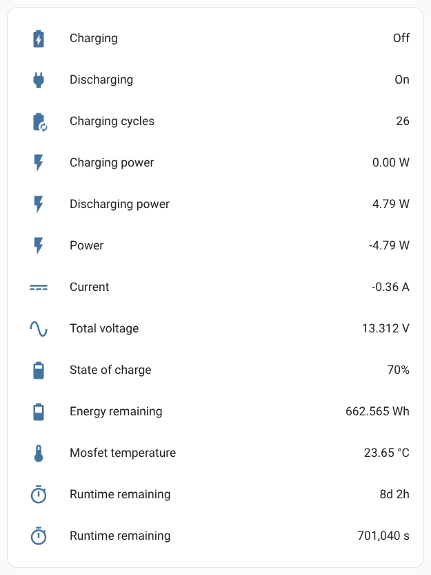

# esphome-ogt-bms


[](https://www.buymeacoffee.com/syssi)

ESPHome component to monitor a Offgridtec Battery Management System via BLE



## Supported devices

* Offgridtec LiFePo4 Smart Pro advertised via BLE as `SmartBat-Axxxxx` (e.g. `SmartBat-A12345`)

## Unsupported devices

* Offgridtec LiFePo4 Smart Pro advertised via BLE as `SmartBat-Bxxxxx` (e.g. `SmartBat-B12345`)

## Requirements

* [ESPHome 2024.6.0 or higher](https://github.com/esphome/esphome/releases)
* Generic ESP32 board

## Installation

You can install this component with [ESPHome external components feature](https://esphome.io/components/external_components.html) like this:
```yaml
external_components:
  - source: github://syssi/esphome-ogt-bms@main
```

or just use the `esp32-ble-example.yaml` as proof of concept:

```bash
# Install esphome
pip3 install esphome

# Clone this external component
git clone https://github.com/syssi/esphome-ogt-bms.git
cd esphome-ogt-bms

# Create a secrets.yaml containing some setup specific secrets
cat > secrets.yaml <<EOF
bms0_ble_name: MY_BMS_BLE_NAME
bms0_mac_address: MY_BMS_MAC_ADDRESS

wifi_ssid: MY_WIFI_SSID
wifi_password: MY_WIFI_PASSWORD

mqtt_host: MY_MQTT_HOST
mqtt_username: MY_MQTT_USERNAME
mqtt_password: MY_MQTT_PASSWORD
EOF

# Validate the configuration, create a binary, upload it, and start logs
esphome run esp32-ble-example.yaml

```

## Example response all sensors enabled

```
# Battery type A
[binary_sensor:036]: 'ogt-bms-ble charging': Sending state OFF
[binary_sensor:036]: 'ogt-bms-ble discharging': Sending state ON
[sensor:093]: 'ogt-bms-ble power': Sending state -5.19168 W with 2 decimals of accuracy
[sensor:093]: 'ogt-bms-ble charging power': Sending state 0.00000 W with 2 decimals of accuracy
[sensor:093]: 'ogt-bms-ble discharging power': Sending state 5.19168 W with 2 decimals of accuracy
[sensor:093]: 'ogt-bms-ble runtime remaining': Sending state 701040.00000 s with 0 decimals of accuracy
[text_sensor:064]: 'ogt-bms-ble runtime remaining': Sending state '8d 2h'
[sensor:093]: 'ogt-bms-ble charging cycles': Sending state 26.00000  with 0 decimals of accuracy
[sensor:093]: 'ogt-bms-ble state of charge': Sending state 70.00000 % with 0 decimals of accuracy
[sensor:093]: 'ogt-bms-ble energy remaining': Sending state 662.56500 Wh with 3 decimals of accuracy
[sensor:093]: 'ogt-bms-ble mosfet temperature': Sending state 23.65001 °C with 2 decimals of accuracy
[sensor:093]: 'ogt-bms-ble current': Sending state -0.36000 A with 2 decimals of accuracy
```

## Known issues

None.

## Debugging

If this component doesn't work out of the box for your device please update your configuration to increase the log level to see details about the BLE communication and incoming traffic:

```
logger:
  level: VERY_VERBOSE
  logs:
    esp32_ble: DEBUG
    esp32_ble_tracker: VERY_VERBOSE
    ogt_bms_ble: VERY_VERBOSE
    scheduler: DEBUG
    component: DEBUG
    sensor: DEBUG
    mqtt: INFO
    mqtt.idf: INFO
    mqtt.component: INFO
    mqtt.sensor: INFO
    mqtt.switch: INFO
    api.service: INFO
    api: INFO
    api: INFO
```

## References

* https://github.com/patman15/BMS_BLE-HA/blob/main/custom_components/bms_ble/plugins/ogt_bms.py
